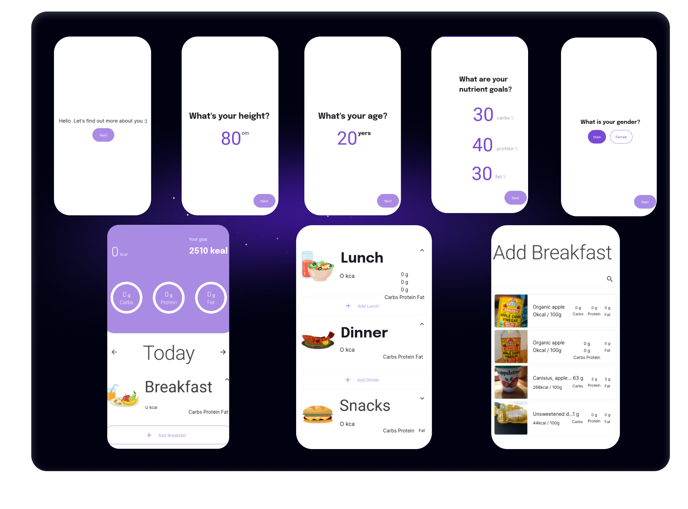

 # Calories Tracker Application
 

 
# Introduction

The Calories Tracker Application is a modern, feature-rich, and easy-to-use app designed to help users keep track of their calorie intake. Developed using Jetpack Compose Kotlin for Android, the app offers various categories of food data fetched from a freely accessible API and allows users to select different meal types like Dinner, Breakfast, Lunch, and Snacks.

This application is a demo project for educational purposes and serves as an excellent example of best practices in software development, with a focus on clean architecture, a multi-module structure, and extensive test coverage, including unit tests, end-to-end tests, and Android tests.

# API

The app fetches food data from a freely accessible API (provide the API URL here). This API provides data in various food categories. Since it's a free API, you can use the same API in the source code provided in this project.
Libraries Used

The application uses several libraries and technologies, including:
```
    -Coil: An image loading library for Android backed by Kotlin Coroutines.
    -Coroutines: Kotlin's way of handling long-running tasks efficiently and effectively.
    -Dagger Hilt: A fully static, compile-time dependency injection library to simplify DI in your projects.
    -Google libraries: Various Google libraries have been used for better user interface and accessibility.
    -Kotlin: The main programming language for development.
    -Moshi: A modern JSON library for Kotlin and Java.
    -Retrofit: A type-safe HTTP client for Android and Java.
    -Hilt Testing: A library for simple and efficient testing in conjunction with Dagger Hilt.
    -Compose Testing: A library for testing Jetpack Compose UIs.
    -MockWebServer: A library for mocking web servers for testing HTTP clients.
    -CoroutinesTest: A library for testing Kotlin Coroutines.
    -JUnit: The most popular framework for testing Java code.
```
# Architecture

The project follows the principles of Clean Architecture, which separates code into layers with clear responsibilities and rules for interaction. It's a multi-module architecture designed to make the codebase easier to manage and maintain.
Getting Started
```
    Clone this repository.
    Open the project directory in Android Studio.
    Obtain your API key and add it in the project.
    Run the application.
```
   #  Testing

The Calories Tracker Application has extensive test coverage, including:

    Unit tests: These tests ensure the correctness of the smallest pieces of code in isolation.
    End-to-End tests: These tests cover complete functionality of the application from start to finish, ensuring the system works together as a whole.
    Android tests: These tests validate the behavior of the components in the Android framework.

All the tests help to ensure the robustness and reliability of the application, contributing to maintainability and scalability.
